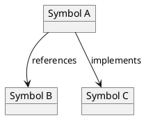

# Translating Neovim LSP Data to PlantUML

This document explains how to take the data provided by Neovim's LSP client and translate it into a PlantUML diagram to visualize symbol relationships.

## Core LSP Concepts

The LSP protocol provides several requests that are useful for our goal:

*   `textDocument/definition`: Goes to the definition of a symbol.
*   `textDocument/references`: Finds all references to a symbol.
*   `textDocument/implementation`: Finds all implementations of a symbol.

We can use these to build a graph of symbol relationships.

## Getting LSP Data in Neovim

Neovim provides the `vim.lsp.buf` module to interact with the LSP client. We can use the following functions to get the data we need:

*   `vim.lsp.buf.definition()`
*   `vim.lsp.buf.references()`
*   `vim.lsp.buf.implementation()`

These functions are asynchronous and take a callback function to handle the results.

Here's an example of how to get the definition of the symbol under the cursor:

```lua
local params = vim.lsp.util.make_position_params()
vim.lsp.buf.definition(params, function(err, result)
  if err then
    vim.notify("LSP error: " .. tostring(err), vim.log.levels.ERROR)
    return
  end

  if result and not vim.tbl_isempty(result) then
    -- Process the result
    vim.print(result)
  else
    vim.notify("No definition found", vim.log.levels.INFO)
  end
end)
```

## PlantUML Syntax

PlantUML has a simple syntax for creating diagrams. We can use object diagrams to represent our symbols and their relationships.

Here's an example of a simple PlantUML object diagram:



This creates three objects and draws arrows between them with labels.

## Mapping LSP Data to PlantUML

Now we can map the LSP data to PlantUML. The overall process is:

1.  Get the symbol under the cursor. This will be the root of our graph.
2.  Get the definition, references, and implementations for that symbol.
3.  For each result, create a PlantUML object.
4.  Create relationships between the root symbol and the other symbols.

Here is a Lua function that demonstrates this process:

```lua
local function generate_plantuml(symbol, definition, references, implementations)
  local plantuml = {"@startuml"}

  -- Add the root symbol
  table.insert(plantuml, string.format('object "%s" as %s', symbol.name, symbol.name))

  -- Add definition
  if definition then
    local def_obj = string.format('"%s" as def', definition.uri)
    table.insert(plantuml, string.format('object %s', def_obj))
    table.insert(plantuml, string.format('%s --> def : defines', symbol.name))
  end

  -- Add references
  for _, ref in ipairs(references) do
    local ref_obj = string.format('"%s" as ref%d', ref.uri, #plantuml)
    table.insert(plantuml, string.format('object %s', ref_obj))
    table.insert(plantuml, string.format('ref%d --> %s : references', #plantuml - 1, symbol.name))
  end

  -- Add implementations
  for _, impl in ipairs(implementations) do
    local impl_obj = string.format('"%s" as impl%d', impl.uri, #plantuml)
    table.insert(plantuml, string.format('object %s', impl_obj))
    table.insert(plantuml, string.format('%s --> impl%d : implements', symbol.name, #plantuml - 1))
  end

  table.insert(plantuml, "@enduml")
  return table.concat(plantuml, "\n")
end
```

This function takes the symbol information and the results from the LSP requests and generates a PlantUML string. You can then write this string to a file and use a tool like the PlantUML web server or a local installation to generate the diagram.

## Configuration

Some of the commands in this plugin can be configured to provide different levels of detail.

### GraphImplementations

The `GraphImplementations` command can be configured with a `level` option:

- `level=1` (default): Shows the filenames of the implementations.
- `level=2`: Shows the names of the implementation symbols.
- `level=3`: Shows the names and kinds (class, interface, etc.) of the implementation symbols.

**Note:** Level 3 can be slow as it requires fetching symbol information for each implementation file.

Example:

```lua
-- Get implementations with level 2 detail
require('graphDaCode.graphDaCode').get_implementations_plantuml({ level = 2 })
```
